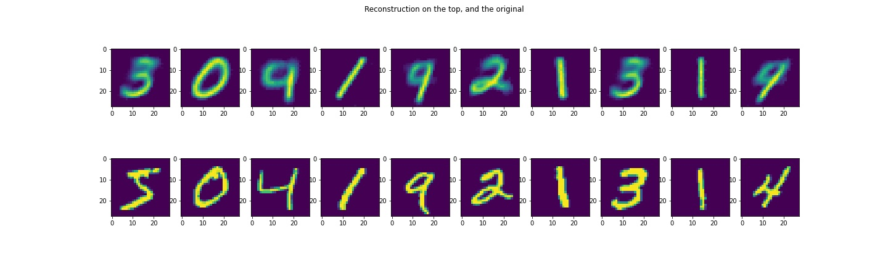
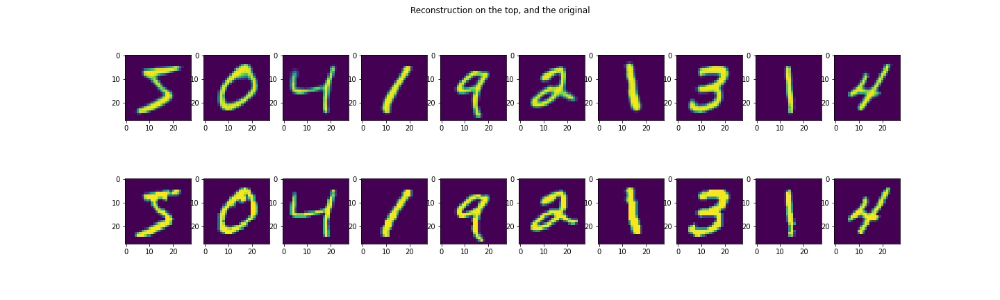

# VAE

This repository implements a generic and fast template for variational auto-encoders (see arxiv.org/pdf/1906.02691.pdf)

For a different usage (dataset), just a new constructs file needs to be written.

-----
An example usage on the MNIST dataset is provided.

### 2-D latent space:

### 49D latent space:
